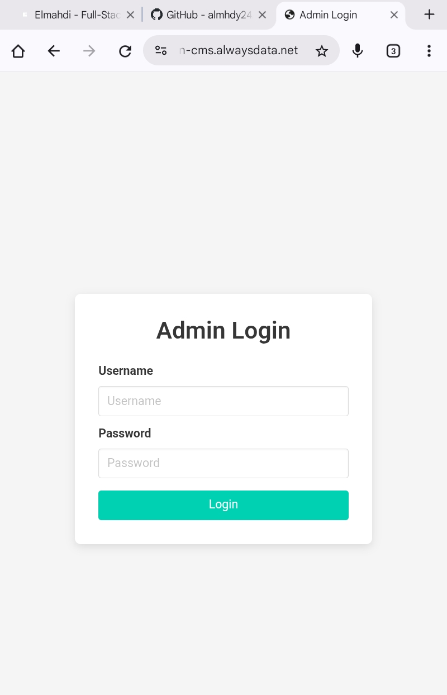
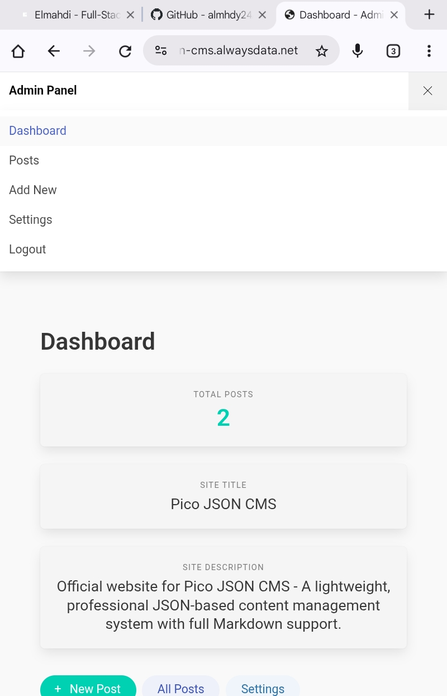
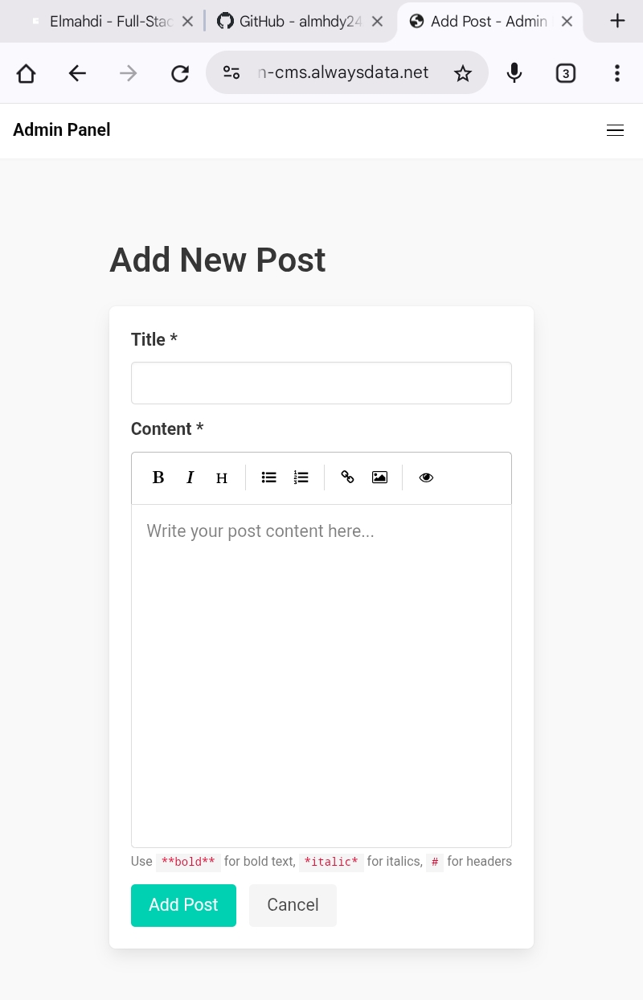
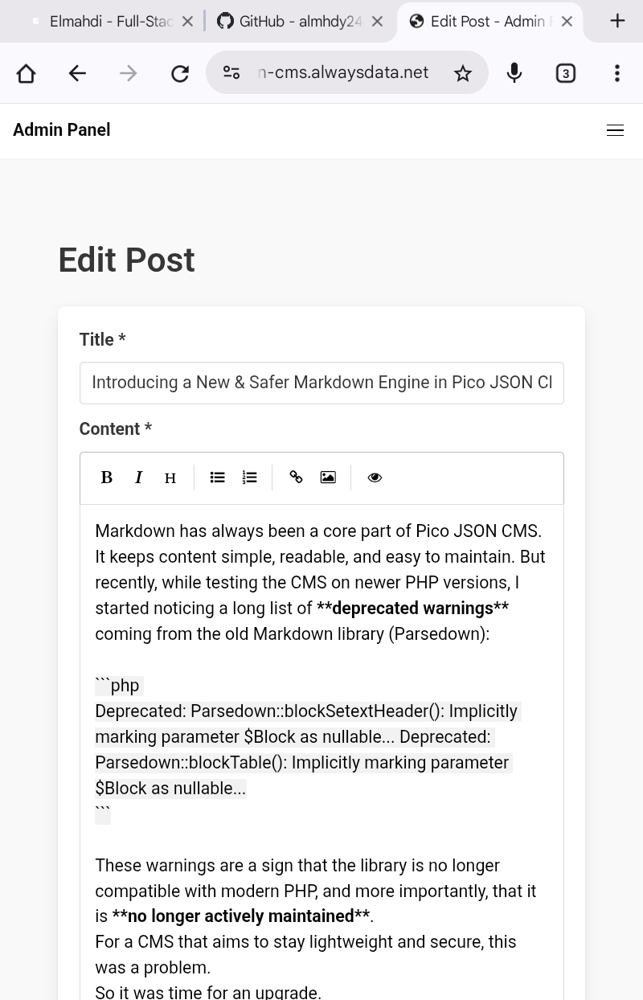
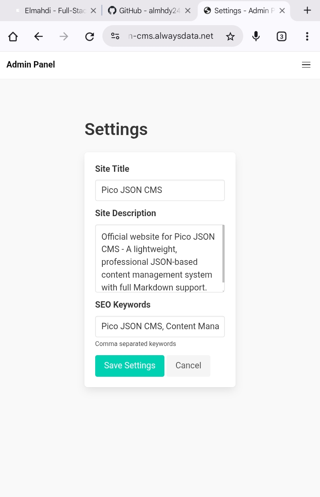
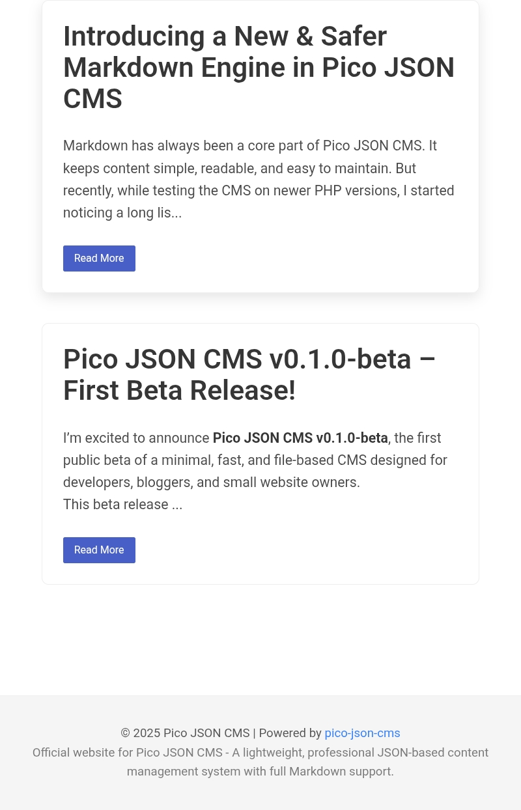

# Pico JSON CMS

A **lightweight, database-less Content Management System** built with PHP and JSON files.

Designed for **small websites, low-resource servers, and rapid deployment** where a full database setup is unnecessary.

---

## 🌟 Live Demo & Documentation

- **Live Demo:** [https://pico-json-cms.alwaysdata.net/](https://pico-json-cms.alwaysdata.net/)  
- **Documentation:** [https://pico-json-cms.alwaysdata.net/docs](https://pico-json-cms.alwaysdata.net/docs)

---

## 🧩 Why Pico JSON CMS?

Many small projects don’t need:
- Complex databases
- Heavy CMS platforms
- Large hosting resources

**Pico JSON CMS** solves this by using:
- JSON files as storage
- Simple PHP architecture
- Minimal configuration

Ideal for:
- Personal websites
- Landing pages
- Student projects
- Small business sites
- Offline or low-cost hosting

---

## ✨ Features

- 📁 JSON-based content storage (no database)
- 🔐 Simple admin panel
- 📝 Create, edit, delete content
- ⚡ Fast and lightweight
- 🧱 Clean, readable PHP code
- 📦 Easy to deploy on shared hosting

---

## 🛠 Tech Stack

- PHP 7.4+
- JSON file storage
- HTML / CSS
- Minimal JavaScript

No framework required.

---

## ⚙️ Installation

1. Clone or download the repository:

    git clone https://github.com/almhdy24/pico-json-cms.git

2. Upload files to your PHP server.

3. Ensure write permission for the data directory:

    chmod -R 755 data/

4. Open the project in your browser:

    http://localhost/pico-json-cms

---

## 🔐 Admin Access

Default credentials (change after first login):

    Username: admin
    Password: admin123

---
## 📂 Project Structure

    pico-json-cms/
    │── .github/               # GitHub workflows and CI
    │── assets/                # UI assets (CSS/JS/images)
    │── controllers/           # Backend controllers
    │── core/                  # Core CMS logic
    │── docs/                  # Documentation (site/docs)
    │── models/                # Data models
    │── plugins/               # Plugin extensions
    │── themes/
    │   └── default/           # Default theme templates
    │── .gitignore
    │── .htaccess
    │── admin.php              # Admin entry script
    │── composer.json
    │── composer.lock
    │── config.php             # Global config
    │── functions.php          # Shared functions
    │── index.php              # Frontend entry

---

## 📌 Use Cases

- Simple CMS without MySQL
- Projects where database access is restricted
- Educational purposes
- Rapid prototyping

---

## ⚠️ Limitations

- Not designed for large-scale applications
- No built-in user roles (admin only)
- JSON storage not suitable for high concurrency

---

## 🚀 Future Improvements

- Role-based access
- Content versioning
- File uploads
- API mode

---

## 📸 Screenshots

---

## 👨‍💻 Author

**Elmahdi Abdallh**  
Backend & full-stack PHP developer  

🌐 Website: https://pico-json-cms.alwaysdata.net/
📫 Email: contact@almhdy.sd 

---

⭐ If you find this useful, feel free to star the repository.
